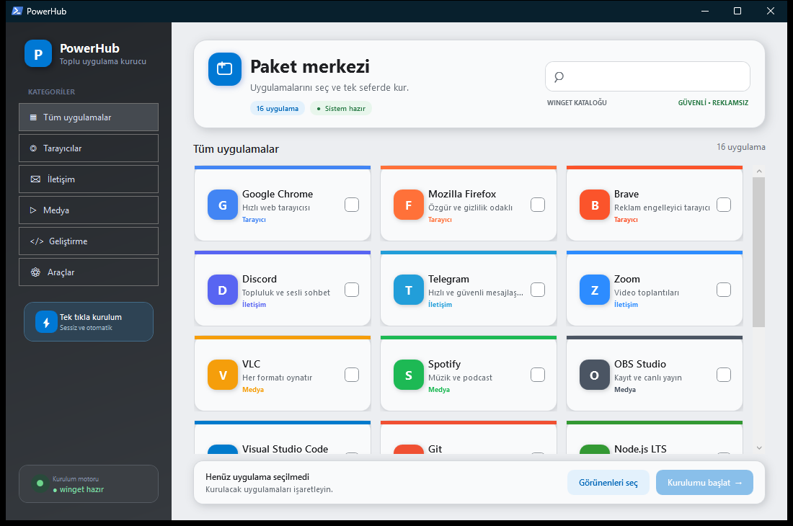

# PowerHub

[Türkçe](#türkçe) · [English](#english)

<p align="center">
  
</p>

## Türkçe

PowerHub, Windows uygulamalarını seçip `winget` üzerinden toplu ve sessiz biçimde kurmak için hazırlanmış modern bir PowerShell/WPF arayüzüdür.

- 21 kategoride 132 güvenli uygulama ve web kaynağı
- Tüm uygulamalar için önbelleğe alınan marka logoları
- Canlı arama, kategori filtreleme, kaynak rozetleri ve kartın tamamından seçim
- WEB kaynaklarında doğrudan site açma; web kartları kurulum seçimine dahil edilmez
- Kurulabilir uygulama kartlarında seçimi değiştirmeden açılan resmî site düğmesi
- Klavye kısayolları: `Ctrl+F` ara, `Ctrl+A` görünenleri seç, `Esc` temizle, `Enter` kurulumu başlat
- Canlı terminal günlükleri ve kurulum ilerlemesi
- Winget eksikse durum kartından Microsoft Store gerektirmeyen otomatik kurulum
- Windows Sandbox için mimariye uygun WinGet bağımlılıkları ve SHA-256 doğrulaması
- Winget paketi bulunmayan seçili araçlar için resmî indirme sayfası

### Hızlı çalıştırma

PowerShell'e aşağıdaki komutu yapıştırın:

```powershell
irm https://bygog.github.io/PowerHub/install.ps1 | iex
```

Başlatıcı, güncel `PowerHub.ps1` dosyasını `%LOCALAPPDATA%\PowerHub` klasörüne indirir ve Windows PowerShell'i STA modunda kullanarak arayüzü açar. Her çalıştırmada en güncel sürüm alınır.

### Gereksinimler

- Windows 10 veya Windows 11
- Windows PowerShell 5.1 ya da PowerShell 7
- Microsoft App Installer ile gelen `winget`
- İnternet bağlantısı

### Güvenlik

İnternetten alınan bir betiği çalıştırmadan önce içeriğini incelemek için:

```powershell
irm https://bygog.github.io/PowerHub/install.ps1
```

Ana uygulama dosyasını doğrudan görüntülemek için:

```text
https://bygog.github.io/PowerHub/PowerHub.ps1
```

---

## English

PowerHub is a modern PowerShell/WPF interface for selecting and silently installing multiple Windows applications through `winget`.

- 132 safe applications and web resources across 21 categories
- Cached brand logos for every application
- Live search, category filtering, source badges, and full-card selection
- Direct site launching for WEB resources; web cards are excluded from installation selection
- Official website button on installable app cards without changing selection
- Keyboard shortcuts: `Ctrl+F` search, `Ctrl+A` select visible, `Esc` clear, `Enter` install
- Live terminal logs and installation progress
- Store-independent App Installer setup from the status card when winget is missing
- Architecture-aware WinGet dependencies and SHA-256 verification for Windows Sandbox
- Official download pages for selected tools not packaged by winget

### Quick start

Paste the following command into PowerShell:

```powershell
irm https://bygog.github.io/PowerHub/install.ps1 | iex
```

The bootstrapper downloads the latest `PowerHub.ps1` to `%LOCALAPPDATA%\PowerHub` and launches the interface with Windows PowerShell in STA mode. It retrieves the latest version on every run.

### Requirements

- Windows 10 or Windows 11
- Windows PowerShell 5.1 or PowerShell 7
- `winget`, included with Microsoft App Installer
- An internet connection

### Security

To inspect the remote bootstrapper before running it:

```powershell
irm https://bygog.github.io/PowerHub/install.ps1
```

To view the main application script directly:

```text
https://bygog.github.io/PowerHub/PowerHub.ps1
```
